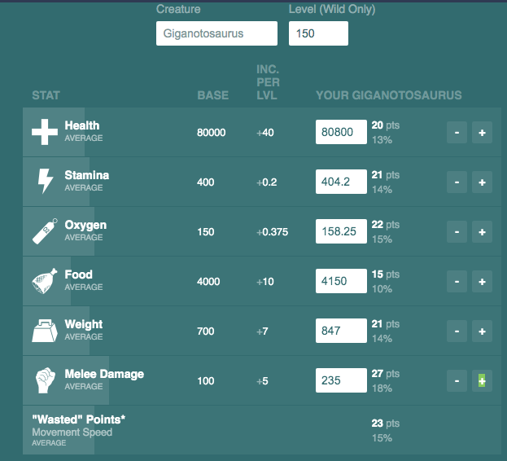
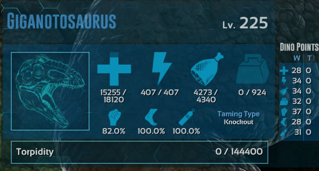
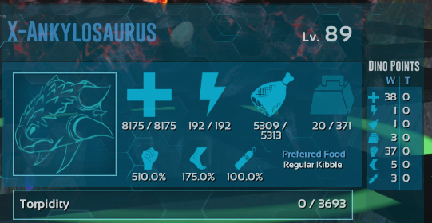
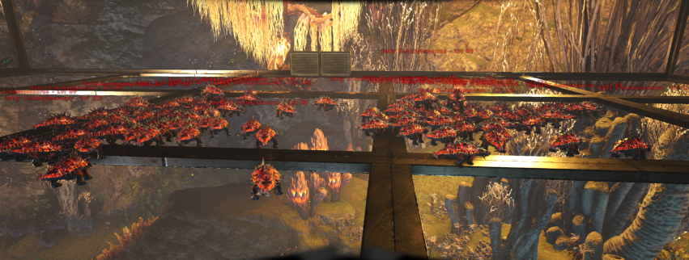
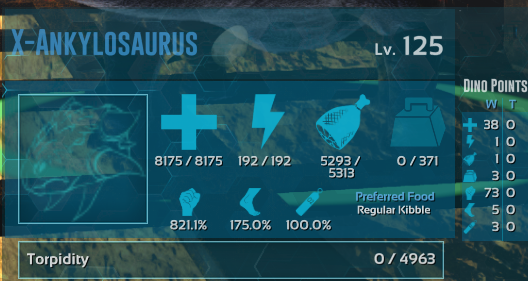

Hello! My name is Psychopation, and I am a part of the Dododex Team on Discord. I have been a "professional" ARK breeder for quite some time now and I would like to share and explain proper breeding techniques. The mutation system in ARK is incredibly confusing to an unexperienced breeder, and from my experience and others, it takes time, knowing the proper techniques, and sometimes it just "clicks" for some people after a certain point. Why am I making this guide? **Because you can go past 20/20 mutations legitimately and breed literal super dinos.**

This extensive guide will include everything from searching for stats, explanation on the point system, min-maxing your dinos, how to properly breed and stack mutations, and probably more! So sit tight and enjoy!

## STAT POINT SYSTEM

All stats in ARK are based around a point system. This is the allocation to each stat from its current level. The easiest way to see and understand this is on Dododex. The picture below is a wild 150 Giga that I knocked out. I input the wild dino's stats and you an see just to the right, it says how many points are in each stat. The reason I love using Dododex is that I can pull up the app on my phone and quickly input stats as I'm looking at the dino.

If you add up all of the points, that equals 149 (+1=150 because level 1 doesn't have stats)

**NOTE:** Dododex stat calculator is for wild stats ONLY. Tamed dinos have a different point system that we will cover a little later.

So as you can see, this Giga is pretty exceptional. On a Giga, the only stat that matters is Melee. All other stats have such minor increases with tamed levels that it does not make a difference. Once I tame it, the stat points will increase randomly by the amount of levels it gains. So on a 150, that comes out to 224 with kibble taming, meaning there are 74 more points that will randomly allocate. It is SUPER important to remember **that the highest stats have a higher chance of getting more points added to that stat.** So thats why we like that 27 melee. Below I have a screenshot of the Giga's stats once it tamed.

_This is a great giga to start with. (Ignore the 82% damage and note the 37 points. My binocular mod is incorrectly showing the damage percentage)_

## BREEDING 
The basics of breeding is pretty simple. You find a male and female of a dino, breed them, and get babies. Simple enough. However the reasons for breeding goes deeper than just getting more dinos. 

1. Raising a baby lets you get an imprint bonus. This bonus increases the dino's stats by 20% with 100% imprinting (assuming vanilla settings). Not only do you get that stat increase, but when you ride a dino that YOU are imprinted to, it gains 30% extra damage and 30% damage resistance.
1. Breeding allows you to combine stats. For example, if you have a Male Rex with 37 points in HP and 24 points in Melee, and a Female Rex with 31 points in HP and 45 points in Melee, you can breed them together and you have a 55% chance for each stat to roll in favor of the higher stat on the babies to get the 37 HP AND 45 Melee. **Note:** This is not a guaranteed chance, so you may need to breed several babies to get the stat you want.

## MUTATION BREEDING

Alright. Now for the bread and butter of the breeding system. I will be explaining using the point system, so if you skipped over it, you may want to read the section on that.

### Min-Maxing and Why You Want to Min-Max

The process of min-maxing is simple, but time consuming. You are quite literally minimizing your useless stats while maximizing your useful stats. There is a reason for this. On official, the max level is 450, and there is a stat cap of 255 for an individual stat. If you have 150 levels in useless stats, you just lost 150 possible points, so you want to reduce those to make room for the important stats. **Note: X-Dinos have a max level of 500 (they do still keep the 255 point stat cap)**

I will be using my current breed line of X-Ankys as examples. There are two stats that matter on an anky. Melee and HP. Melee to get more resources per hit, and HP to not die if you're dropped while being carried or if you're attacked. 

This means you want to minimize Stamina, Food, Oxygen, Weight, and Speed.

So I tamed several X-Ankys until I got an anky with 37 points in melee, and another with 38 HP. I also tamed several Level 5-15 X-Ankys that had 0-5 points in ANY of the minimized stats (make sure you punch the low levels to get a minimal taming bonus).

Once I got all of this, I bred together the low levels until I had a low level anky with the low points in Stam, Food, Ox, Weight, and Speed. Then I bred that with the 37 melee, breeding it until I kept all of those low stats PLUS 37 melee. Then I did the same with the 38 HP. So the final result was a male and female level 89 X-Anky (37(melee)+38(HP)+13(wasted)+1(base)). And thats how you min-max. **Note: You don't necessarily have to do 0 points like I didn't in this example. Anything 0-5 points in a stat is acceptable. 0 points just looks cleaner.**

> **IMPORTANT:** DO NOT LET MUTATIONS RUIN YOUR LINE DURING THIS PROCESS. KILL ANY MUTATION YOU RECEIVE

### Mutations

Mutations manifest in two different ways. A color mutation, and a stat mutation (+2 points in that stat). A dino that gains a mutation will ALWAYS pop with both. **Note: you may not see the color mutation because it can roll in any of the 6 color regions, even if a dino does not have that color region.**

The base chance for a mutation is 7.31%. It is possible to gain a double mutation (+4 in a stat at a 0.184% chance), and it is incredibly rare, but I have also seen a triple mutation (+6 in a stat at a 0.00156% chance). These extra mutations will usually be in two (or three) different stats, but they can also go into one stat.

### Mutation Stacking

Now in order to efficiently breed for mutations, you want a TON of females. My rule is to have at least 50 females. More females=more chances for a mutation. Here is where many people mess up in their breeding. **NEVER CHANGE OUT YOUR FEMALES.** Your females will ALWAYS remain the base level. You only want to change out the male with every new mutation, which means all of your mutations have to be on a male. 
**Note: You can absolutely keep a female with the mutation, you'll just want to breed it with the unmutated male to switch the mutations to a male.**

_I like to hatch in mass amounts, as it takes less time than just hatching a few at a time._

The reason you want to have a matching male and female anky is so that you can easily determine if there is a mutation just by looking at the baby's levels. Notice how most of the ankys in that photo are either level 89 or 125. Thats because I'm on my 18th mutation. So all of the babies come out either with NO stat increase or with the melee stat increase. The only variation is with new mutations, which mostly will be level 91 or 127. I will check each 127 to see if I have a new melee mutation only. Everything else will be killed.

_Here is a picture of my V.18 male's stats. Note every stat is identical to the level 89 from earlier except for the melee._

Now once you reach 20/20 mutations....keep going. Don't change a thing. You should be seeing 20/20 mutations on the patrilineal side, and 0/20 mutations on the matrilineal side. You will continue to get mutations that will be born on the Matrilineal side, but will switch to the Patrilineal side when you breed it with your base level females. You are now 'cheating' the mutation system. As long as one parent has less than 20 mutations, you can continue to get mutations and with this process, they will keep stacking to the male's side. **Note: once you reach 20/20 on the Patrilineal side, your chances of getting a mutation reduces to 3.7%, so you will continue to get mutations, but it will be slower.**

You just continue to repeat this process until you get to 253 or 254 points in the stat you are working on. When you hit 255 you will no longer be able to add levels to that stat.

### F.A.Q.
* What if I want to mutate multiple stats? I like to utilize separate breed lines for each stat. If I wanted to mutate health on my ankys, I would get another 50 females and breed them with an HP mute male. You would then breed your Melee mute with an HP mute when you need an anky.
* I was told to get a level 5 female so its cheap to clone a bunch of females. This is a viable method. However like I mentioned earlier, having both the base male and female the exact same level makes it incredibly easy to notice mutations, whereas if your level 5 has 2 levels in a stat, it could confuse you and then waste your own time checking its stats. I'm all about efficiency! And as a bonus, raising females just costs some time instead of valuable element!
* So I have my newly mutated male, I can kill my old one right? I highly advise not. You never know when you may make a mistake and need to go back to a previous generation, and if you kill the previous male, you have to go back to even earlier generations, wasting more of your time!

Feel free to ping me in the [Dododex Discord](http://discord.gg/B73mT2x) channel if you have any further questions!
Be on the lookout for more guides coming soon! You can find myself and the rest of my content creator team at [magibrigade.com](http://magibrigade.com/)