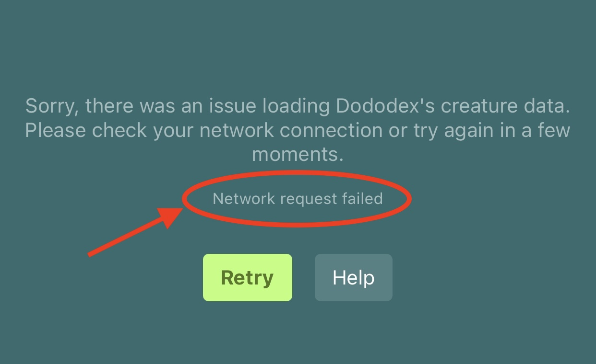

<b>⚠️ Ongoing Outages April 11-12, 2024:</b> Dododex has been experiencing intermittent outages for some users due to a DNS issue caused by a mistake made by its incompetent hosting provider. Unfortunately, this issue is out of Dododex's control and will hopefully be resolved soon. Check <a href="https://www.twitter.com/Dododex">@Dododex</a> on Twitter or Discord for the most recent updates regarding this issue. Apologies for the inconvience!

> If your Dododex App on iOS or Android is not loading, please try the following steps to resolve the issue.

If you see an error labeled "Sorry, there was an issue loading Dododex's creature data. Please check your network connection or try again in a few moments." this is a generic error. Please follow the steps below.

If the error under this one says "JSON parse error", this is usually my fault and I can fix it immediately. Please contact me by tweeting to Dododex or emailing dan14lev+dododex@gmail.com.

## 1. Try force closing the Dododex app

Sometimes there's an error that simply needs the app to be force closed.

On Android:

1.  Open the Settings app.
2.  Choose Apps.
3.  Touch the Running tab to view only active or running apps.
4.  Choose Dododex
5.  Touch the Stop or Force Stop button.

On iOS:

1.  Press the Home (hardware) button twice.
2.  Swipe the Dododex app up so that it removes it from your running apps.

## 2. Try manually checking for new data

If there was an error loading Dododex's data, it's possible that this could be causing the issue.

-   In the Dododex App, tap the menu icon.
-   In the menu, tap "Settings / Multipliers."
-   At the very bottom of the screen, tap "Check for New Data."

The app should refresh and load properly.

## 3. Try switching between cellular data and wifi or toggling airplane mode

If Dododex works correctly on cellular data but not wifi, or vice versa, it could indicate that there's an issue with your wifi or cellular connection.

## 4. Ensure you haven't disabled cellular data for the app

It's possible to block cellular data for an individual app. When this happens, Dododex will show the error "Network request failed" but the status bar of your phone will show that you have an internet connection. On iOS, you can re-enable cellular data by going to the Settings App > Dododex > Enable "Cellular Data".

## 5. Check to see if you can load Dododex.com in your browser

When you open Dododex, the app loads the latest creature data from dododex.com. While this is rare, some users have reported that their internet service provider is blocking dododex.com.

Some schools, companies, or government organizations have Wifi networks that block gaming sites. In addition, some users have reported that their phone plan (for example, T-mobile or AT&T) had parental controls enabled that blocked Dododex, possible because of references to "violence" (*eye roll*).

1.  Open your phone's web browser (such as Safari, Google Chrome, etc.).
2.  Visit [dododex.com](https://www.dododex.com/).

If you see some sort of error and you're not sure how to fix it yourself, please contact Dododex support.

## 6. Try reinstalling the app

While this should be a last case scenario, reinstalling the app will usually fix the issue. Note that you will lose your app's settings (multipliers, server settings, favorite recipes and dinos, saved weapons...).

## Still not working?

1.  *Wait a few minutes.* There might have been a brief server hiccup.
2.  Email me at dan14lev+dododex@gmail.com. Please include the full error message (circled below) you're seeing and any other information.

