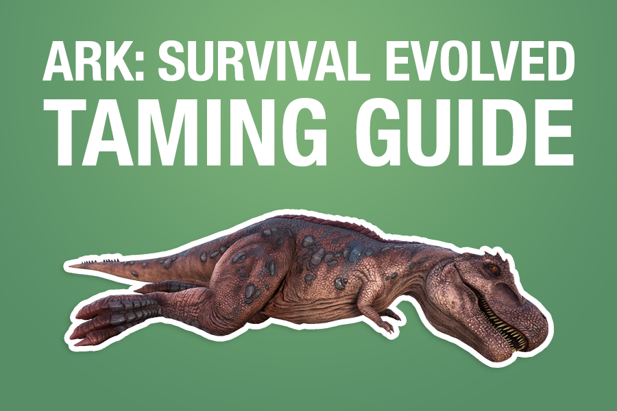

To tame a creature in ARK: Survival Evolved, you must feed it a set number of its preferred food. Some creatures must be knocked out first (knock-out taming) while others can be fed while they are conscious (passive taming).

> For all your taming needs, use [Dododex.com](https://www.dododex.com/), or Dododex on [Android](https://play.google.com/store/apps/details?id=com.danlev.dododex&hl=en_US&gl=US) or [iOS](https://apps.apple.com/us/app/dododex-ark-survival-evolved/id1071311292).

## 1. Check Dododex for the Required Resources
Gather the required resources:

1.  Creature's preferred food. Check Dododex to see which food to use. You may consider bringing a few extra just in case.

2.  A tranquilizing weapon and ammo (for knock out tames), such as tranq arrows, tranq darts, a slingshot, etc.

3.  Narcotics (for knock out tames), such as Narcoberries or Narcotics, if required. Generally, if you're taming with a higher quality foods or taming a lower level dino, you'll need less narcotics, or possibly none.

## 2. Determine the Taming Method
Creatures generally must be tamed using one of the three methods:

1.  **Knock Out Taming ([list of creatures](https://www.dododex.com/dinosaurs/knockout-taming)) (most common)** --- Inflicting torpor until the creature is tranquilized and the feeding it while it's unconscious.
2.  **Passive Taming ([list of creatures](https://www.dododex.com/dinosaurs/passive-taming))** --- Walking up to the creature and feeding it while it's conscious. (sometimes called non-violent taming, but often still can be violent)
3.  **Other** --- Taming a creature in some way that's unique to that dino, such as feeding sacrifices to a [Troodon](https://www.dododex.com/taming/troodon), letting a [Noglin](https://www.dododex.com/taming/noglin) mind-control your dinos, or swimming along side a [Megachelon](https://www.dododex.com/taming/megachelon).

## 3. Consider trapping the creature or bringing it to your taming pen.
Some players prefer to use "taming pens" -- a structure made to trap a dino so you can tranquilize or tame it from within a pen. This can be helpful to make it easier to tranquilize the dino and ensure you or the dino does not get attacked during the taming process. In PvP, it can provide some defense from enemies.

You can also use the natural environment -- such as cliffs or environmental structures -- to "trap" a dino while tranquilizing.

[YouTube Video: Pen Taming](https://www.youtube.com/watch?v=_--y2fm32jw)

## 4. Tranquilized the creature (for knock-out tames only)
Next is the most difficult part. You'll want to tranquilize the creature. This can be difficult depending on how aggressive and strong the creature is, how quick it is, and how much torpidity you need to inflict before it knocks out.

Approach the creature and tranquilize it with your weapon until it knocks out. As soon as you hit the creature, it will either attack you or flee. Be prepared!

_Full guide:  [How to Knock Out a Dinosaur in ARK: Survival Evolved](https://help.dododex.com/en/article/how-to-knock-out-a-dinosaur-in-ark-survival-evolved)_

## Choosing the best weapon
Generally, you would want to use your strongest weapon possible. Stronger weapons not only require less hits, but they typically will induce less damage, decreasing the chance of death. Dododex will show you a list of weapons and which weapons are the most effective at knocking out a creature.

> **PRO PLAYER TIP:** At this point, more veteran players may choose to check the creature's base stats to ensure it's worth taming. You can use Dododex's stat calculator to determine how good a creature's stats are.

## 5. Feed it food
**For knock-out taming:** Now that your creature is knocked out, you can begin feeding it. Simply open its inventory and **transfer all of the required resources into the dino's inventory.** Once the creature is hungry enough, it'll consume one item. This process will repeat until it has consumed all food in its inventory. Be sure it has enough; if it reaches a point where it eats all of the food in its inventory and still needs more, the taming meter will begin to decrease. Dododex will tell you how long each bite will take, and the total time required.

**For passive taming:** Put the creature's preferred food into the last slot of your hotbar and approach the creature. Use the action button to feed the dino. Note that for passive tames, the interval after the first feeding will usually take a longer period of time since the dino needs to reach a certain level of hunger before it can begin eating regularly after the first feeding. Dododex will tell you how long each bite will take --- including the first longer interval --- and the total time required.

> **MAKE SURE YOUR DINO DOESN'T GET ATTACKED:** If your dino gets attacked during taming, it can significantly lose taming effectiveness or die.

> **Tip:** To prevent any accidental loss of resources, you can consider [starve taming](https://help.dododex.com/en/article/how-to-starve-tame-in-ark-survival-evolved) a creature.

## 6. Keep it tranquilized so it doesn't wake up while you're feeding it (knock-out taming only)

While it's taming, you need to make sure it doesn't wake up by feeding it Narcotics. Keep an eye on the Torpor meter and make sure it doesn't reach 0. Check Dododex's Narcotics section to see how many Narcotics are required.

Note that Narcotics won't be required every time you tame, and less will be used if 1) your creature is lower level 2) the food you're using is faster and 3) your creature is an early-game creature (usually).

If your creature wakes up, taming will reset and you will have lost all resources. 

## 7. Your creature is tamed! Give it a name!

Your creature will tame and [gain bonus levels](https://help.dododex.com/en/article/how-do-creature-levels-work-in-ark-survival-evolved). If you aren't sure what to name it, check the creature's "Tips" section on Dododex and go to the "Name Ideas" section to find a creative name!
